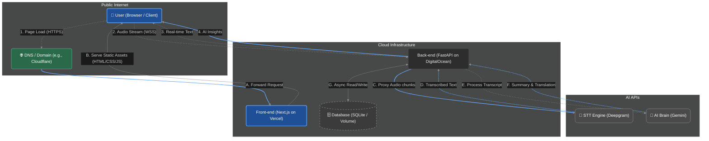

# 🌐 AI Call Assistant

> A real-time, full-stack AI voice assistant designed to bridge language barriers during professional phone calls. 

AI Call Assistant captures live audio, performs ultra-low latency Speech-to-Text (STT) transcription, and leverages Generative AI to provide instant bilingual summaries, translations, and actionable smart replies.

## ✨ Key Features

* **Ultra-Low Latency Streaming:** Real-time bidirectional audio streaming via WebSockets.
* **Context-Aware AI:** Dynamically adjusts translations and reply suggestions based on the selected scenario (e.g., Software Engineering Interview, Customer Support).
* **Bilingual Smart Replies:** Generates context-perfect responses with native Text-to-Speech (TTS) integration for immediate vocalization.
* **14-Language Support:** Comprehensive bidirectional translation mapping.
* **Multi-Tenant Authentication:** Secure user sign-up and data isolation powered by Clerk.
* **Session Persistence & Export:** Automatically logs call histories to a database with one-click exports to Markdown, PDF, CSV, and JSON.
* **Dynamic Theming:** Seamlessly switch between Light, Dark, and Cyberpunk UI themes.

## 🏗️ System Architecture

This project strictly adheres to a separation of concerns, utilizing a concurrent streaming pipeline:

1. **The Client (Next.js):** Captures microphone audio via the `MediaRecorder` API and streams binary data over WebSockets.
2. **The Proxy Engine (FastAPI):** Receives audio chunks and proxies them to Deepgram's live endpoint for sub-second transcription.
3. **The AI Brain (Google Gemini):** Processes full sentences to generate structured JSON payloads (Summaries, Translations, Replies).
4. **Data Persistence (SQLAlchemy):** Asynchronously commits session metadata to a relational database.

%%{init: {'theme': 'dark', 'themeVariables': { 'primaryColor': '#1a1a1b', 'edgeLabelBackground':'#1a1a1b', 'tertiaryColor': '#1a1a1b'}}}%%
graph TD
    %% Define Nodes
    User("👤 User<br/>(Browser / Client)")
    Vercel("Front-end<br/>(Next.js on Vercel)")
    DNS("🌐 DNS / Domain<br/>(e.g., Cloudflare)")
    DO("Back-end<br/>(FastAPI on DigitalOcean)")
    SQLite[("🗄️ Database<br/>(SQLite / Volume)")]
    Deepgram("🎤 STT Engine<br/>(Deepgram)")
    Gemini("🧠 AI Brain<br/>(Gemini)")
    
## System Architecture

The application follows a decoupled architecture, optimizing for both fast static asset delivery and low-latency real-time communication. 



## 🛠️ Tech Stack

**Frontend**
* Framework: Next.js 15 (React 19)
* Styling: Tailwind CSS
* Authentication: Clerk
* State Management: React Hooks (`useRef`, `useState`, `useEffect`)

**Backend**
* Framework: FastAPI (Python)
* Async Server: Uvicorn
* Database ORM: SQLAlchemy & aiosqlite (PostgreSQL-ready)
* AI/ML APIs: Deepgram (STT), Google GenAI SDK (Gemini 3.1 Flash Lite)

**DevOps & Deployment**
* Containerization: Docker & Docker Compose
* Reverse Proxy & SSL: Caddy Server
* Hosting: Vercel (Frontend) + DigitalOcean Droplet (Backend)

## 🚀 Getting Started (Local Development)

### Prerequisites
* Node.js (v20+)
* Python 3.12+
* Docker & Docker Compose
* API Keys for [Deepgram](https://deepgram.com/), [Google AI Studio](https://aistudio.google.com/), and [Clerk](https://clerk.com/)

### 1. Clone the Repository
```bash
git clone [https://github.com/Ryan-z-Feng-ccsf/ai-call-assistant.git](https://github.com/Ryan-z-Feng-ccsf/ai-call-assistant.git)
cd ai-call-assistant
```

### 2. Backend Setup (Dockerized)
Create a .env file in backend/app/:

Code snippet
```bash
DEEPGRAM_API_KEY=your_deepgram_api_key
GEMINI_API_KEY=your_gemini_api_key
CLERK_PUBLISHABLE_KEY=your_clerk_publishable_key
CLERK_SECRET_KEY=your_clerk_secret_key
ALLOWED_ORIGINS=http://localhost:3000
```

Build and spin up the backend container:

```bash
cd backend/app
docker compose up --build -d
```

The FastAPI server will be running at http://localhost:8000.


### 3. Frontend Setup
Create a .env.local file in frontend/:

Code snippet
```bash
NEXT_PUBLIC_API_URL=http://localhost:8000
NEXT_PUBLIC_CLERK_PUBLISHABLE_KEY=your_clerk_publishable_key
CLERK_SECRET_KEY=your_clerk_secret_key
```

Install dependencies and run the development server:

```bash
cd frontend
npm install
npm run dev
```
The UI will be accessible at http://localhost:3000.


🌍 Production Deployment

This application is designed for cloud-native deployment:

Frontend: Deployed on Vercel with environment variables pointing to the production API.

Backend: Containerized via Docker and deployed on a DigitalOcean Droplet.

Security: Caddy handles automatic SSL termination (wss:// and https://) via Let's Encrypt.

📄 License
This project is open-source and available under the MIT License.


